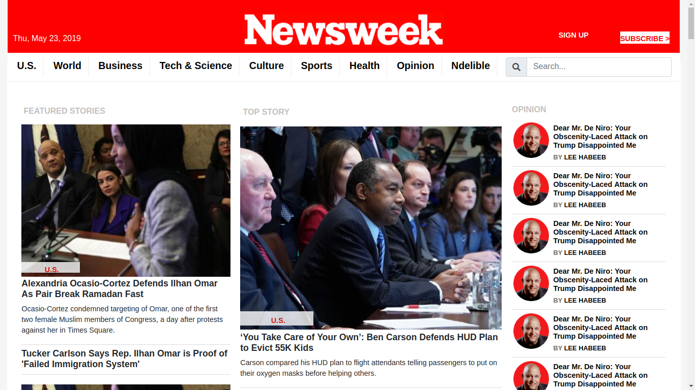

# Using-Bootstrap

Clone of nesweek magazine website https://www.newsweek.com/ using twitter's bootstrap with learning purposes.

The close is designed to be responsive in all screen sizes implementing bootstrap CSS classes.

Live demo: 

https://rawcdn.githack.com/samgaco/Using-Bootstrap/346ac575dbc3eaa096890ef5ece5f590132d17eb/index.html

## Author

Samuel García Companys – [@samgaco] – samuelgarciacompanys@gmail.com

